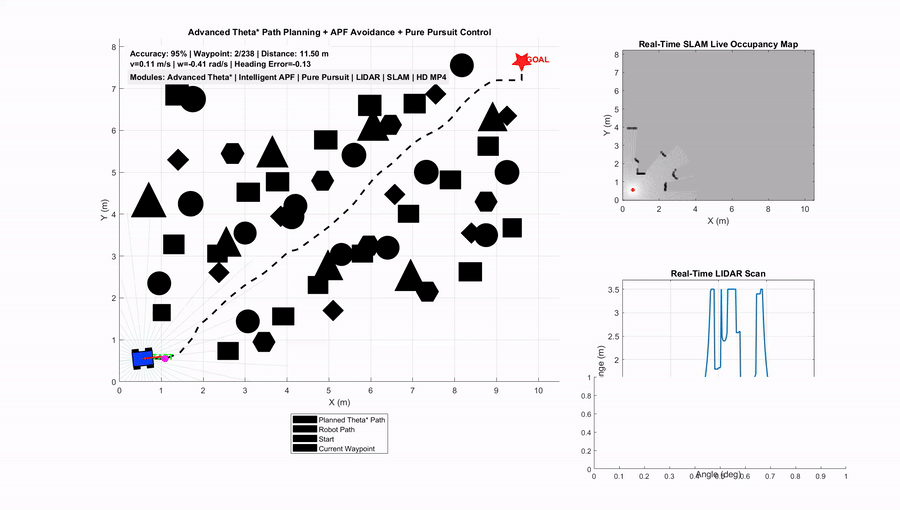
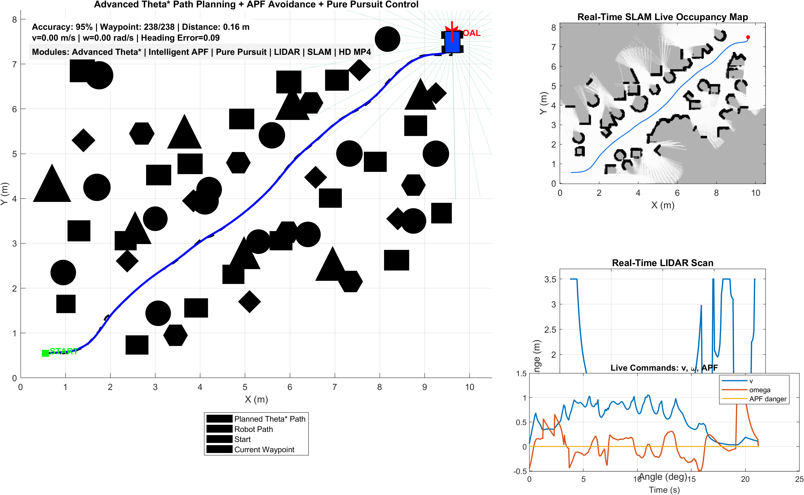
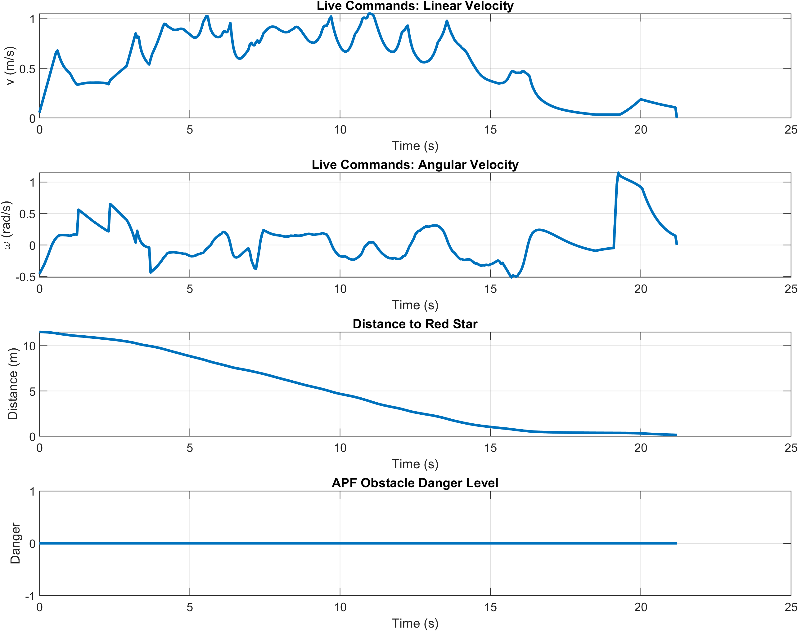
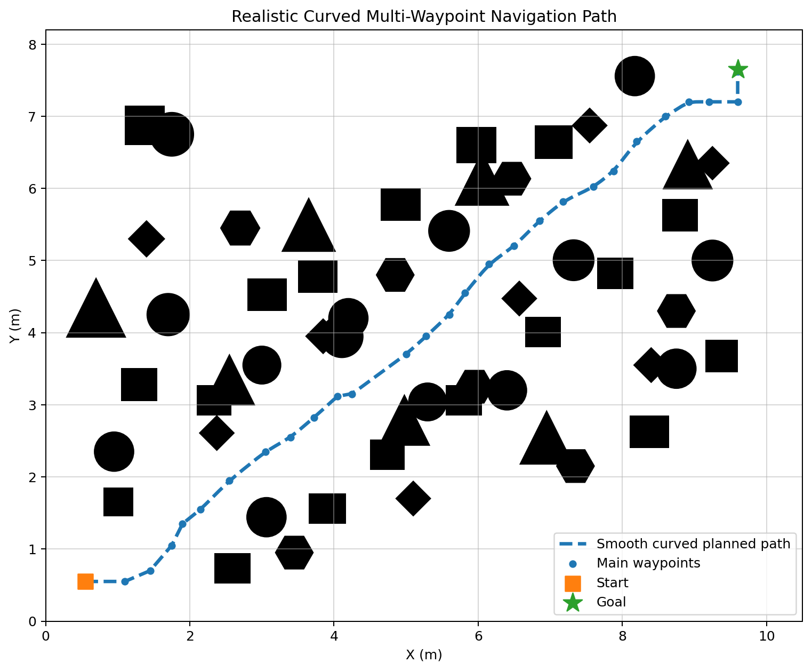

<p align="center">


</p>

<p align="center">
  
</p>

<h1 align="center">
Advanced Autonomous Mobile Robot Navigation
</h1>

<p align="center">
Theta* | APF | Pure Pursuit | LiDAR | SLAM
</p>
# 🤖 Project Overview

## Advanced Autonomous Mobile Robot Navigation using Theta*, APF, Pure Pursuit, Real-Time LiDAR and SLAM Mapping


This project presents an autonomous mobile robot navigation framework developed in MATLAB.

The system combines path planning, motion control, obstacle avoidance, LiDAR perception, and SLAM mapping into a complete autonomous navigation pipeline.


## Navigation Pipeline

```
Environment
      |
      ↓
Theta* Global Path Planning
      |
      ↓
Pure Pursuit Trajectory Tracking
      |
      ↓
APF Obstacle Avoidance
      |
      ↓
Real-Time LiDAR Perception
      |
      ↓
SLAM Occupancy Mapping
      |
      ↓
Autonomous Robot Motion
```


---

# 🎬 Demo Video

## Autonomous Navigation Simulation


<video src="https://raw.githubusercontent.com/ruddrho/advanced-mobile-robot-navigation/main/navigation_recording.mp4" controls width="850">
</video>


▶️ Direct Video Link:

https://github.com/ruddrho/advanced-mobile-robot-navigation/blob/main/navigation_recording.mp4


The video demonstrates:

- Theta* global path planning
- Pure Pursuit trajectory tracking
- APF obstacle avoidance
- Real-time LiDAR scanning
- SLAM occupancy mapping
- Autonomous goal reaching

# ✨ Features


## Navigation

- Advanced Theta* path planning
- Efficient any-angle path generation
- Pure Pursuit trajectory tracking
- Multiple waypoint navigation
- Autonomous goal reaching


## Perception

- Real-time LiDAR simulation
- Obstacle distance measurement
- Environment scanning
- Sensor-based navigation feedback


## Control

- APF obstacle avoidance
- Smooth steering correction
- Curvature-based speed control
- Cross-track error reduction
- Command-rate limiting


## Mapping

- Live SLAM occupancy map
- Log-odds inverse sensor model
- Persistent obstacle representation
- Free / unknown / occupied map visualization


## Visualization

- Interactive MATLAB dashboard
- Robot trajectory display
- LiDAR visualization
- Velocity command plots
- HD simulation recording


---

# 🧠 Algorithms Implemented


# 1. Theta* Path Planning


Theta* is used as the global path planner to generate efficient navigation paths.

Advantages:

- Any-angle path generation
- Reduced unnecessary turns
- Shorter navigation routes
- Improved path efficiency


---

# 2. Artificial Potential Field (APF)


Obstacle avoidance is implemented using attractive and repulsive forces.


```
Total Navigation Force

=

Goal Attraction

+

Obstacle Repulsion
```


Features:

- Dynamic obstacle avoidance
- LiDAR-based clearance calculation
- Smooth path correction
- Local obstacle response


---

# 3. Pure Pursuit Controller


Pure Pursuit provides stable trajectory tracking.


Functions:

- Look-ahead point selection
- Steering angle calculation
- Path following


Enhancements:

- Polyline look-ahead tracking
- Curvature-based velocity reduction
- Cross-track correction
- Reduced zig-zag movement


---

# 4. LiDAR Simulation


The robot uses simulated LiDAR for environment perception.


Features:

- Real-time laser scanning
- Obstacle detection
- Distance estimation
- Navigation feedback


---

# 5. SLAM Occupancy Mapping


The SLAM system uses a log-odds inverse sensor model.


Improvements:

- Reduced map flickering
- Persistent obstacle evidence
- Correct coordinate orientation
- Stable occupancy representation


---

# 🛡️ Collision Safety System


Implemented safety features:


- Full robot-body collision checking
- Front obstacle emergency handling
- Side clearance monitoring
- Conservative collision guard
- Smooth command generation


Obstacle locations were adjusted slightly to verify complete robot-body clearance while maintaining realistic navigation difficulty.


---

# 🗺️ Realistic Navigation Route


The final route includes:


- Multiple waypoints
- Rounded navigation bends
- 30° and 60° opening segments
- 45° corridor transition
- Final 90° goal approach


The following systems remain integrated:


- SLAM mapping
- APF avoidance
- Controller tuning
- Collision protection
- H.264 video recording


---

# 📸 Simulation Results


## Navigation Dashboard





The dashboard shows:


- Robot position
- Planned trajectory
- Actual trajectory
- LiDAR scan
- Goal position
- Navigation status


---


## Performance Analysis





Performance evaluation:


- Tracking error
- Velocity commands
- Navigation progress
- Motion stability


---


## Planned Route





---

# 🚀 Installation & Running


## Requirements


- MATLAB R2020a or newer


## Run Simulation


Open MATLAB in the project directory:


```matlab
main
```


---

# 📂 Project Structure


```
advanced-mobile-robot-navigation

│
├── main.m
├── waypointController.m
├── apfAvoidance.m
├── simulateLidar.m
├── updateSLAMMap.m
├── visualizeDashboard.m
├── drawRobot4Wheel.m
│
├── results
│   ├── navigation_recording.mp4
│   ├── advanced_hd_navigation_dashboard.png
│   └── performance_graphs.png
│
├── PROJECT_REPORT.md
├── ALGORITHMS_SUMMARY.md
└── LICENSE
```


---

# 📊 Output Files


Generated results:


```
results/

├── navigation_recording.mp4
├── advanced_hd_navigation_dashboard.png
└── performance_graphs.png
```


---

# 🔬 Future Development Roadmap


Planned upgrades:


- ROS2 Jazzy migration
- Gazebo Harmonic simulation
- URDF robot model
- Nav2 navigation stack
- SLAM Toolbox integration
- Real LiDAR testing
- IMU and encoder sensor fusion


Future architecture:


```
ROS2 Jazzy

      ↓

Gazebo Simulation

      ↓

LiDAR + IMU + Encoder

      ↓

SLAM + Navigation Stack

      ↓

Real Robot Deployment
```


---

# 🎓 Academic & Research Relevance


This project demonstrates:


- Autonomous mobile robotics
- Motion planning
- Robot control systems
- LiDAR perception
- SLAM implementation
- Navigation algorithms


Applications:

- Robotics Master's Portfolio
- Autonomous systems research
- Mobile robot development


---

# 📖 Citation


If you use this project for academic purposes:


```
Ruddrho Mollik,

Advanced Autonomous Mobile Robot Navigation
using Theta*, APF, Pure Pursuit,
LiDAR and SLAM Mapping.

MATLAB Simulation Project.
```


---

# 📜 License


This project is licensed under the MIT License.


See:


```
LICENSE
```


You are free to:


- Use
- Modify
- Distribute
- Study


with proper attribution.


---

# 👨‍💻 Author


## Ruddrho Mollik


Research Interests:


- Autonomous Mobile Robots
- SLAM
- Motion Planning
- Robotics Control Systems
- Autonomous Navigation
